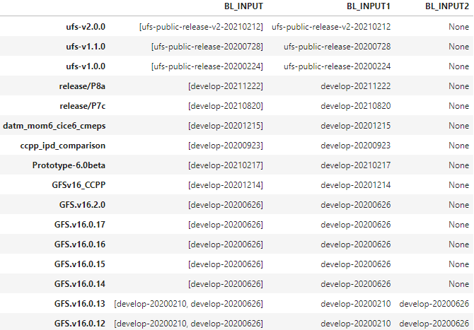
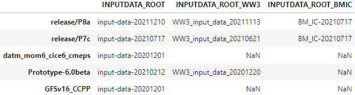

<h1 align="center">
Mapping UFS Weather Model Repository Tag Versions to Datasets
</h1>

    
    

<h5 align="center">
    
[Prerequisites](#Prerequisites) • [Dataset](#Dataset) • [Quick Start](#Quick-Start) • [Status](#Status)
 • [What's Included](#What's-Included) • [Documentation](#Documentation) • [References](#Creator(s))

</h5>

# About

__Introduction:__

Each unique code release version of NOAA's Unified Forecast System (UFS) weather model repository points to the datasets for which its code release version utilizes. These datasets include the input data required by the UFS weather model and the baseline data required for performing the regression tests of various UFS applications. The names of the datasets are timestamped and hard-coded into each unique code release version framework (aka "Github Tags"). This script will provide users/developers of the UFS weather model repository and its associated repositories a more user friendly way of determining which input and baseline datasets should be utilized for a given code release version of the UFS weather model repository.

__Purpose:__

The purpose of this script is to extract the unique names of the timestamped input and baseline datasets (e.g. input_data_YYYYMMDD) for a given UFS weather model repository's code release version. To avoid users/developers from searching for the hard-coded timestamped names of the datasets within the code for a given UFS weather model repository release version, the extraction and mapping of the timestamped datasets to UFS weather model code release version will provide a more user friendly way for users/ developers to determine which dataset is being utilized for a given code release version.

__Capabilities:__

This script will be able to perform the following actions:

- As release versions of the UFS weather model repository are being pushed out onto Github, this script will be able to extract each UFS weather model repository release version's name and access the scripts pointing to their corresponding timestamped input and baseline datasets directly from Github.

- Provide an information regarding a given Github repository such as:

  - Repository's name
  - Repository's description
  - Repository's created date.
  - Repository's number of tags
  - Repository's list of release versions/tags
  - Repository's number of forks
  - Repository's programming language
  - Repository's number of stars
  
- Provide a map/dictionary/table of the most recent UFS code release versions/tags to their corresponding UFS timestamped input and baseline datasets.

__Future Capabilities:__

With additional features added to this script, the script can be utilized for mapping the release versions of the Short Range Weather (SRW) model and Mid-Range Weather (MRW) model repository to their respective timestamped datasets.
Prerequisites:

This script utilizes the Github API. The Github API will cap a user from making N number of requests from its Github server within a narrow window of 1-2 hours, thus it is advise that the user of this script logs in with thier Github credentials when using the Github API to maximize the number of requests they can make from the Github server.

# Table of Contents
* [Prerequisites](#Prerequisites)
* [Dataset](#Dataset)
* [Quick Start](#Quick-Start)
* [Status](#Status)
* [What's Included](#What's-Included)
* [Documentation](#Documentation)
* [References](#Creator(s))

# Prerequisites
* Python 3.9

# Dataset
* N/A

# Quick Start
* For demonstration purposes, refer to 'Read_TagVersion_Datasets_V4_022322.ipynb'

# Status

# What's Included
Within the download, you will find the following directories and files:

* Data Analytics Tool:
    > Read_TagVersion_Datasets_V4_022322.ipynb
* List of Dependencies: 
    > environement.yaml

# Documentation

# References
* N/A

# Version:
* Draft as of 02/23/22

